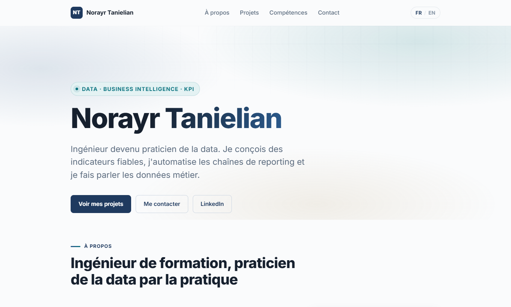

# Portfolio — Norayr Tanielian

Site portfolio bilingue FR/EN, orienté Data / Business Intelligence / KPI.
Conçu, développé et déployé en autonomie complète.

**→ [portfolio.tanielian.fr](https://portfolio.tanielian.fr)**



---

## Pourquoi ce dépôt

Ce site est ma vitrine professionnelle, mais c'est aussi un projet en soi : pas de
template, pas de générateur, pas de bibliothèque de composants. Tout est écrit à la
main pour garder le contrôle sur trois choses qui comptent dans un site vitrine —
le poids, l'accessibilité et la cohérence visuelle.

Le code est donc lisible de bout en bout, et c'est volontaire.

## Stack

| | |
|---|---|
| **Front** | React 18, Vite 6 |
| **Dépendances runtime** | `react`, `react-dom` — et rien d'autre |
| **Styles** | CSS natif, variables custom, aucune dépendance |
| **i18n** | Contexte React maison, dictionnaires JSON externalisés |
| **Hébergement** | AWS Amplify Hosting + CloudFront + Route 53 + ACM |

Aucun framework CSS, aucune bibliothèque d'animation, aucun runtime i18n. Le bundle
de production pèse **55 ko de JavaScript et 4,7 ko de CSS** une fois compressé.

## Architecture

```
src/
├── components/     Un composant = un .jsx + un .css de même nom
├── data/           Contenu structuré (projets, compétences, liens)
├── i18n/           Contexte de langue + fr.json / en.json
├── hooks/          useReveal — animations d'apparition au scroll
└── styles/         variables.css (tokens) + global.css (base, layout, utilitaires)
```

**Séparation contenu / présentation.** Les composants ne contiennent aucun texte en
dur : ils lisent des clés (`t('about.p1')`) et les structures dans `src/data/`. Ajouter
un projet, c'est éditer deux fichiers de données — jamais un composant.

**i18n symétrique.** `fr.json` et `en.json` exposent exactement les mêmes 79 clés. La
langue est détectée depuis `navigator.language`, puis persistée en `localStorage`. Une
clé manquante retourne son propre nom plutôt qu'une chaîne vide, ce qui rend les oublis
visibles en développement.

## Système de design

Tout part de [`src/styles/variables.css`](src/styles/variables.css). Le point central
est une **famille de six teintes**, calées sur la même clarté et la même saturation
pour se lire comme un système plutôt que comme six couleurs indépendantes :

| Teinte | Domaine |
|---|---|
| Bleu | Données, langages |
| Pétrole | BI & dataviz |
| Violet | Automatisation |
| Vert | Web & cloud |
| Ambre | Méthode |
| Rose sourd | Domaine métier |

Chaque carte déclare sa teinte via un attribut de données (`data-group`,
`data-project`, `data-entry`), et le CSS la propage par une variable locale `--g`. Une
compétence BI et le projet BI partagent donc automatiquement la même couleur : la
couleur porte du sens, elle ne décore pas.

Changer une teinte se fait à un seul endroit et se propage à l'ensemble du site.

## Accessibilité et performance

- **Contrastes WCAG AA vérifiés par script** sur tous les textes colorés, fond clair
  comme fond sombre — y compris les pastilles teintées et le pied de page
- Lien d'évitement, structure de titres cohérente, `:focus-visible` explicite
- `prefers-reduced-motion` respecté : animations d'apparition et pulsation désactivées
- Cibles tactiles à 44 px minimum sur mobile
- Photo servie en 4 largeurs via `srcSet` / `sizes` — 7 ko sur mobile au lieu de 51
- Aucun débordement horizontal, vérifié par mesure DOM à 412, 900 et 1440 px

## Déploiement

```bash
npm run deploy
```

[`scripts/deploy.mjs`](scripts/deploy.mjs) enchaîne build, archivage, envoi vers
Amplify, attente de fin de job, puis invalidation CloudFront.

L'archive ZIP est **écrite à la main** plutôt que via l'outillage système. Sous
Windows, `Compress-Archive` (PowerShell 5.1) écrit les chemins internes avec des
antislashes ; Amplify ne les interprète alors pas comme des dossiers et l'intégralité
de `/assets` part en 404 — sans le moindre message d'erreur au déploiement. Le script
sérialise donc les en-têtes ZIP lui-même, avec des slashes.

## Développement

```bash
npm install
npm run dev
```

| Commande | Effet |
|---|---|
| `npm run dev` | Serveur de développement Vite |
| `npm run build` | Build de production dans `dist/` |
| `npm run preview` | Sert le build de production en local |
| `npm run deploy` | Build + mise en ligne + invalidation CDN |

## Contact

- **Site** — [portfolio.tanielian.fr](https://portfolio.tanielian.fr)
- **LinkedIn** — [norayr-tanielian](https://www.linkedin.com/in/norayr-tanielian-a54264220)
- **E-mail** — norayrgarotanielian@gmail.com

---

Le contenu éditorial et les visuels de ce dépôt sont la propriété de Norayr Tanielian.
Le code est consultable à titre d'illustration.
